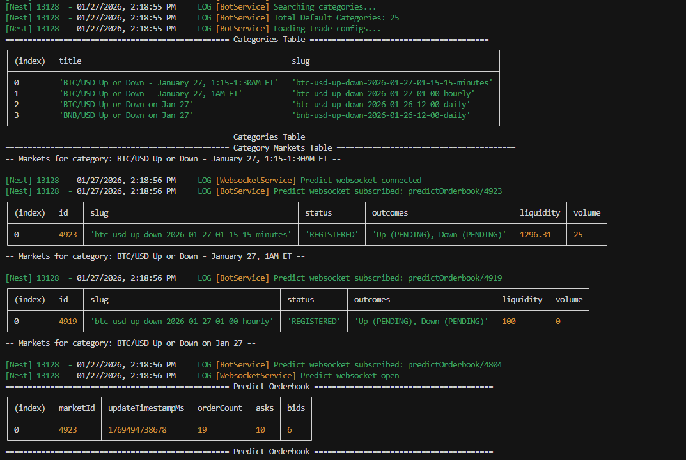

## Prediction Market Trading Bot

Automated trading bot for [Predict.fun](https://predict.fun/) that connects to the Predict HTTP + WebSocket APIs, evaluates market opportunities in real time, places signed orders, and tracks trades/configuration in PostgreSQL via Prisma.

The bot is worker-oriented: `BotService` handles startup and refresh loops, `TradeService` executes auto-trade and sell logic (stop-loss/profit-taking), and `PredictRepository` persists trade/config state. This is designed for continuous execution to increase trading activity while enforcing configurable risk and timing controls.



_The image above shows the Predict bot interface._

## Trading Strategies

- Buy the highest average price outcomes of Prediction Markets with market variant of CRYPTO Prices UP/DOWN.

## Install dependencies

```bash
pnpm install
```

## Environment variables

Environment variables are documented here: `docs/env.md`.

## Architecture and flow

- Architecture overview and responsibilities: `docs/architecture.md`
- End-to-end worker refresh/auto-trade sequence: `docs/architecture.md#sequence-diagram-short-worker-flow`
- Trading behavior by market variant: `docs/trading.md`


_See the full diagrams in `docs/architecture.md`._

## Run tests

```bash
# unit tests
pnpm run test

# e2e tests
pnpm run test:e2e

# test coverage
pnpm run test:cov
```

## Run migrations

```bash
pnpm run migration:run
```

## Start the app

```bash
# development
pnpm run start

# watch mode
pnpm run start:dev

# production mode
pnpm run start:prod
```
