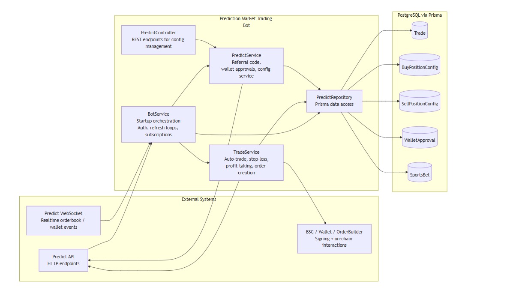
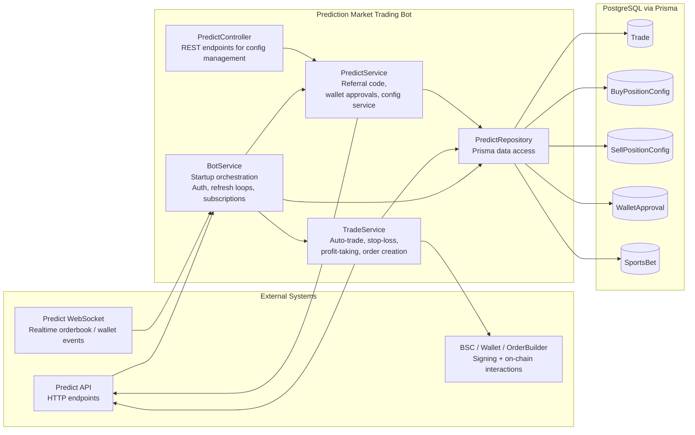
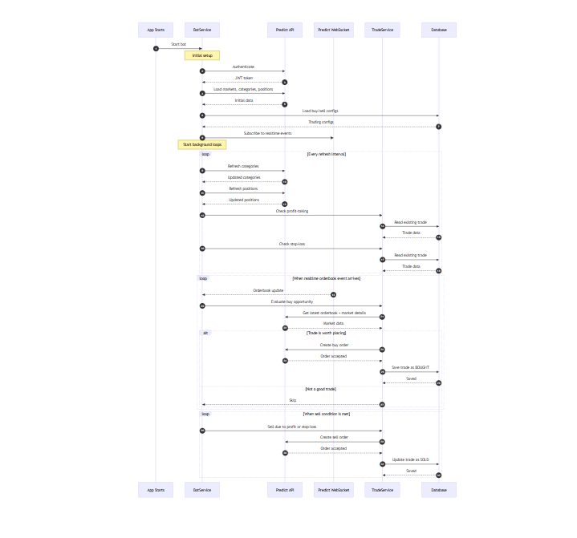
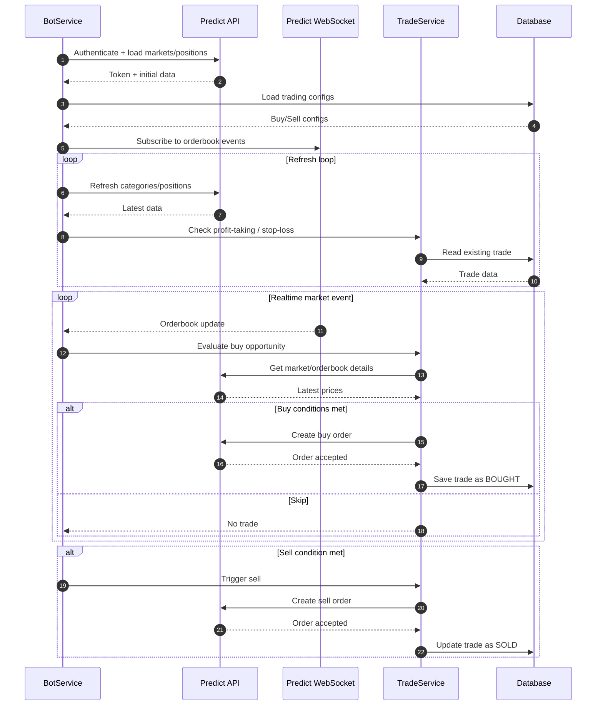

# Architecture

This document describes how the prediction market trading bot is structured and how its worker/refresh loops execute end-to-end.

## Components (high level)

- **BotService** (`src/bot/bot.service.ts`): Orchestrates startup, authentication, initial data loading, WebSocket subscriptions, and background refresh loops.
- **TradeService** (`src/trade/trade.service.ts`): Implements buy/sell execution logic, auto-trade decisions from orderbook events, stop-loss, and profit-taking.
- **PredictService** (`src/predict/predict.service.ts`): Handles referral setup, approvals, and config-oriented service methods.
- **PredictRepository** (`src/predict/predict.repository.ts`): Prisma data access for trades, wallet approvals, and strategy config records.
- **PredictController** (`src/predict/predict.controller.ts`): REST endpoints for creating/updating buy/sell configuration.
- **Data layer**: PostgreSQL via Prisma (`Trade`, `BuyPositionConfig`, `SellPositionConfig`, `WalletApproval`, `SportsBet`).

## Architecture diagram

_Rendered architecture diagram._

## Sequence diagram (short worker flow)

_Rendered short worker sequence diagram._

## Key runtime notes

- `PREDICT_BOT_ENABLED` gates startup execution.
- WebSocket-driven auto-trade is controlled by `PREDICT_WS_ENABLED` and `PREDICT_WS_AUTO_TRADE`.
- Refresh intervals and throttling are driven by env vars (see `docs/env.md`).
- Trade lifecycle state is persisted in `Trade` records (`BOUGHT` -> `SOLD`).
