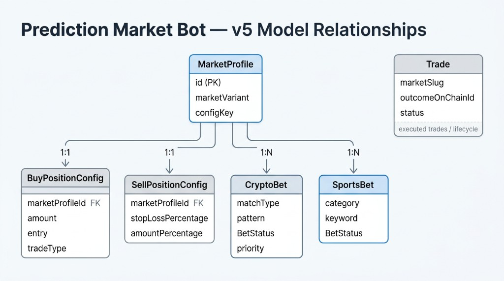
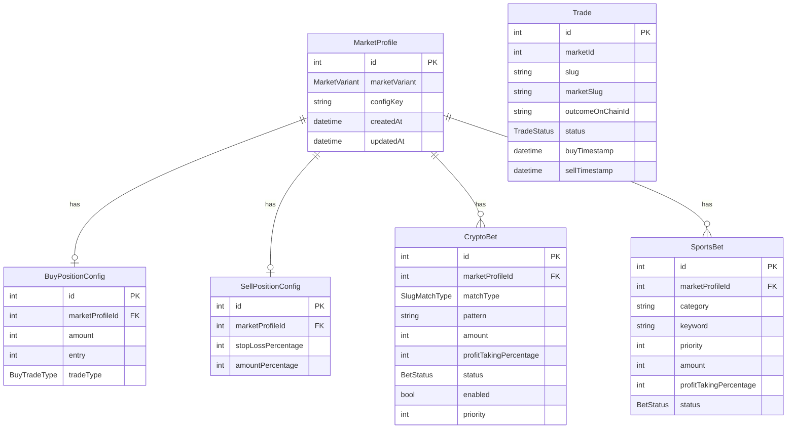
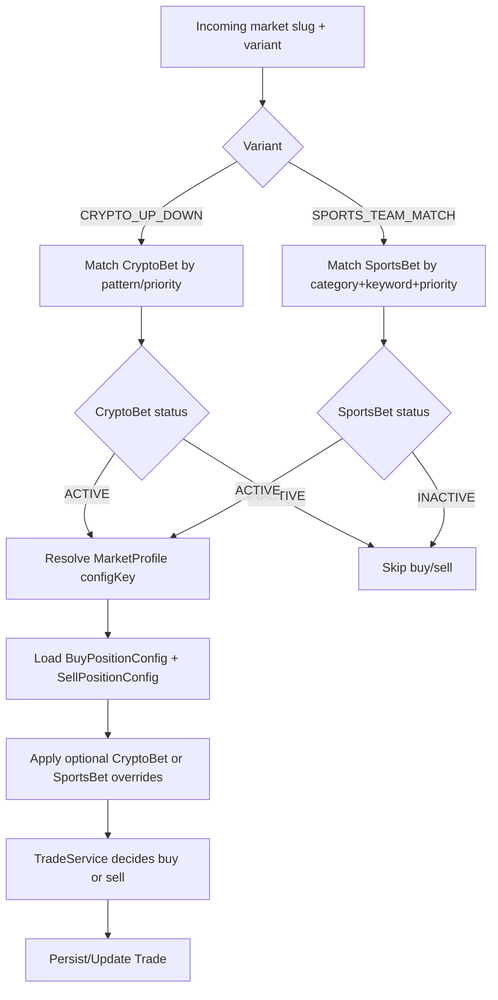

# Model Relationships (v5)

This document explains how strategy/trade models relate to each other in v5 and how those relationships impact runtime behavior.

_v5 model relationships visual._

## Core idea

`MarketProfile` is the parent strategy key (`marketVariant + configKey`) and is referenced by:
- `BuyPositionConfig` (1:1)
- `SellPositionConfig` (1:1)
- `CryptoBet` (1:N)
- `SportsBet` (1:N)

`BuyPositionConfig` and `SellPositionConfig` provide shared defaults per strategy key.

`CryptoBet` and `SportsBet` now carry outcome-level sizing directly:
- `amount`
- `profitTakingPercentage`
- `priority` for deterministic winner selection when multiple matches are possible

`Trade` stores executed buy/sell lifecycle records and ownership keys.

## ER-style relationship diagram

## Runtime decision flow (UI-oriented)

## Status behavior

- `BetStatus.ACTIVE`:
  - matching `CryptoBet` / `SportsBet` is allowed for decisioning.
- `BetStatus.INACTIVE`:
  - matching entry blocks continuation of buy/sell flow for the slug.

This allows temporary pause/rollout control without deleting rules.

## Override behavior

- Buy amount resolution:
  - `SportsBet.amount` / `CryptoBet.amount` (required)
- Profit-taking resolution:
  - `SportsBet.profitTakingPercentage` / `CryptoBet.profitTakingPercentage` when present
  - otherwise env `PREDICT_PROFIT_TAKING_PERCENTAGE`
- Sports team selection:
  - if multiple `SportsBet` rows match the same slug, lower `priority` wins
  - ties fall back to lower `id`

## API mapping

Current strategy endpoints:
- `GET /predict/market-profiles`
- `POST /predict/market-profile`
- `GET /predict/crypto-bets`
- `POST /predict/crypto-bet`
- `PATCH /predict/crypto-bet/:id`
- `GET /predict/sports-bets`
- `POST /predict/sports-bet`
- `PATCH /predict/sports-bet/:id`

Backward-compatible alias endpoints:
- `GET /predict/slug-match-rules`
- `POST /predict/slug-match-rule`
- `PATCH /predict/slug-match-rule/:id`
