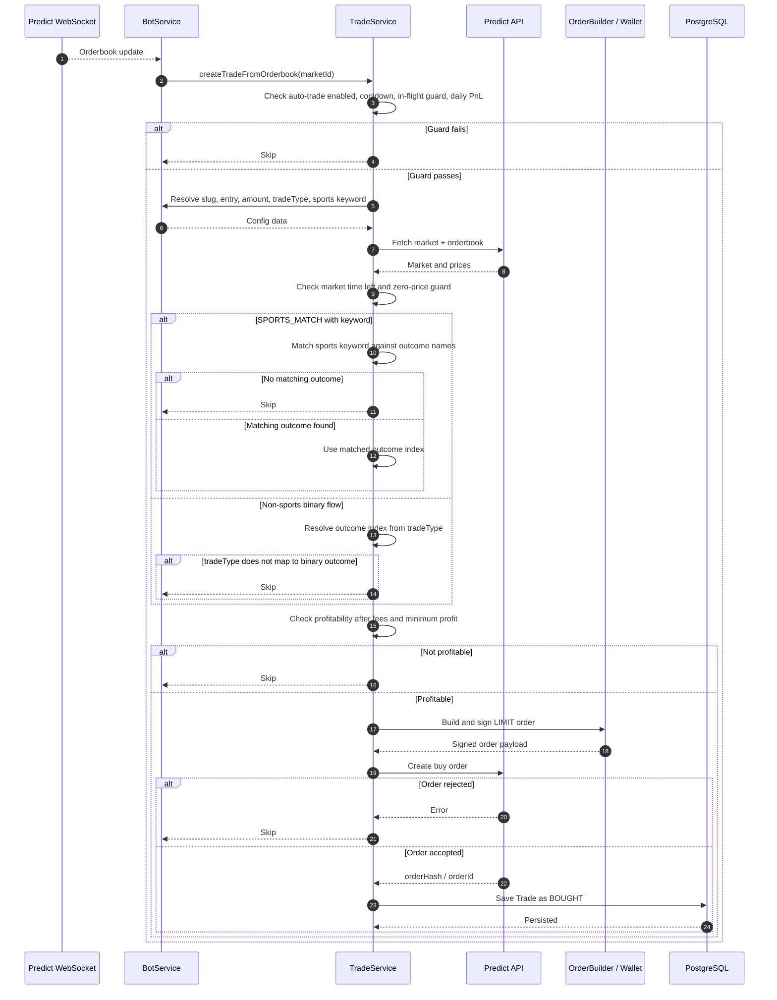
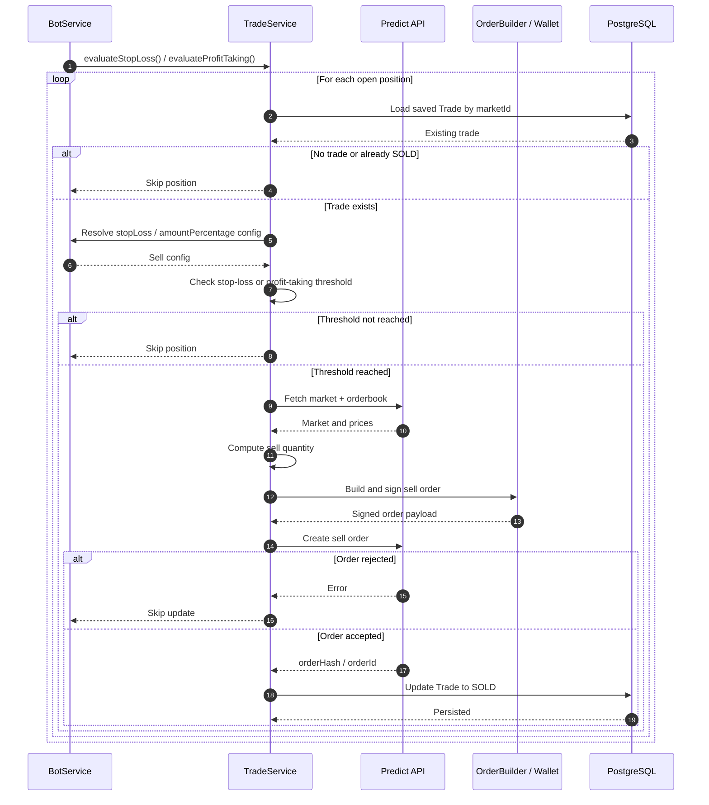

# Trading Behavior

This document describes how the bot decides to buy and sell, which market variants it currently supports, and how configuration records are interpreted at runtime.

## Supported market variants

The bot currently supports these `marketVariant` values for buy configuration:

| Market variant   | Purpose                                            | Config key shape                                             | Supported today |
| ---------------- | -------------------------------------------------- | ------------------------------------------------------------ | --------------- |
| `CRYPTO_UP_DOWN` | Binary price direction markets such as BTC up/down | `slugWithSuffix` suffix match, for example `15-minutes`      | Yes             |
| `SPORTS_MATCH`   | Binary sports/esports match winner markets         | `slugWithSuffix` prefix match plus `SportsBet` keyword match | Yes             |

## Core tables used by trading

### `BuyPositionConfig`

Used to determine whether the bot is allowed to buy and how much it should buy.

- `marketVariant`: variant-specific behavior
- `slugWithSuffix`: matching key used at runtime
- `amount`: USD budget used when building the buy order
- `entry`: number of seconds after market creation before buys are allowed
- `tradeType`: binary outcome selection strategy

### `SellPositionConfig`

Used after a trade already exists.

- `stopLossPercentage`: sell when unrealized loss reaches this threshold
- `amountPercentage`: how much of the position to sell

### `SportsBet`

Used only for `SPORTS_MATCH` markets.

- `category`: slug prefix to match, for example `lol`
- `keyword`: team or outcome keyword to match inside the market slug, for example `g2`

## Trade type behavior

`tradeType` now behaves as follows:

| `tradeType` | Meaning                                                          | Used for               |
| ----------- | ---------------------------------------------------------------- | ---------------------- |
| `yes`       | Always choose binary outcome index `0`                           | Binary markets         |
| `no`        | Always choose binary outcome index `1`                           | Binary markets         |
| `avg-price` | Choose `0` when `yesBuyPrice > noBuyPrice`, otherwise choose `1` | Default for non-sports |
| `na`        | No binary mapping; outcome must come from variant-specific logic | Sports flow            |

Default values on create:

- `CRYPTO_UP_DOWN` defaults to `avg-price`
- `SPORTS_MATCH` defaults to `na`

Legacy stored values are still normalized:

- `greater-than-no` -> `yes`
- `less-than-no` -> `no`

## Variant matching rules

### `CRYPTO_UP_DOWN`

Current matching relies on a supported suffix from `SUPPORTED_SLUG_KEYWORDS`.

Example:

- market slug: `btc-usd-up-down-2026-03-07-10-15-15-minutes`
- `BuyPositionConfig.slugWithSuffix`: `15-minutes`

Behavior:

1. The slug suffix is resolved.
2. The buy config is loaded by that suffix.
3. `entry`, `amount`, and `tradeType` are taken from that config.
4. The bot derives `yesBuyPrice` and `noBuyPrice` from the orderbook.
5. `tradeType` chooses the binary outcome index.

### `SPORTS_MATCH`

Sports trading uses two checks:

1. The category slug must match a supported prefix, currently `lol`.
2. The slug must match a row in `SportsBet`.

Example:

- category slug: `lol-navi-g2-2026-03-07`
- `BuyPositionConfig.slugWithSuffix`: `lol`
- `SportsBet.category`: `lol`
- `SportsBet.keyword`: `g2`

Behavior:

1. The bot resolves the buy config from the supported prefix.
2. The bot checks `SportsBet` rows for a matching category prefix and keyword in the slug.
3. If no sports keyword matches, buy entry is skipped.
4. If a sports keyword matches, the bot looks for an outcome name containing that keyword.
5. If no outcome name matches the keyword, the trade is skipped.
6. If an outcome name matches, that outcome index is used directly.
7. `tradeType` is not used to choose the sports outcome when a sports keyword exists.

## Buy flow

_Rendered buy flow sequence diagram._

## Sell flow

Sell behavior is shared across supported variants.

The bot:

1. loads open positions
2. finds the saved `Trade`
3. checks stop-loss and profit-taking thresholds
4. computes sell quantity from `amountPercentage`
5. creates a sell order
6. updates the persisted trade status to `SOLD`

_Rendered sell flow sequence diagram._

## Important runtime notes

- The buy flow is WebSocket-triggered; it does not scan every market continuously.
- `entry` is interpreted as seconds after market creation.
- If either side has price `0`, the bot skips the market.
- The bot refuses buys that are not profitable after fees.
- For sports, keyword-to-outcome-name matching is authoritative.
- For non-sports binary markets, `tradeType` controls which binary outcome to buy.

## Current implementation assumptions

- `CRYPTO_UP_DOWN` is treated as a binary market with yes/no style pricing.
- `SPORTS_MATCH` assumes outcome names contain enough text to match the `SportsBet.keyword`.
- Current supported slug keywords are:
  - suffix: `15-minutes`
  - prefix: `lol`
