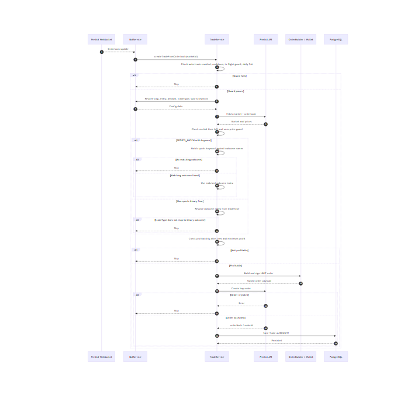
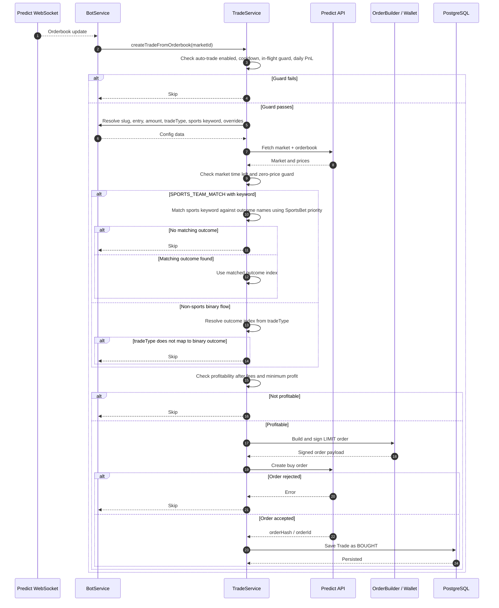
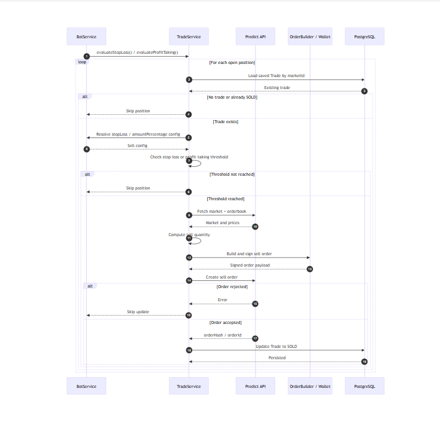
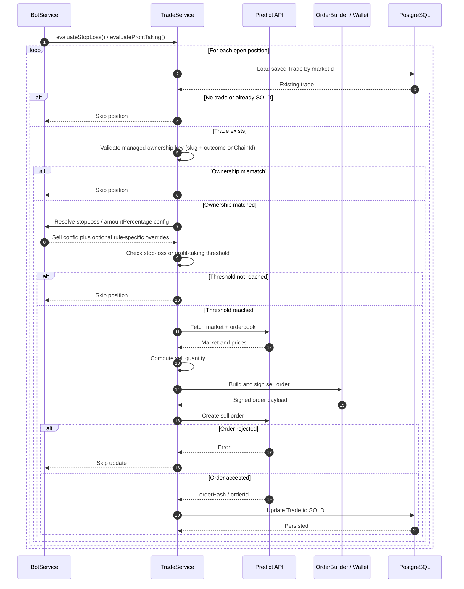

# Trading Behavior

This document describes how the bot decides to buy and sell, which market variants it currently supports, and how configuration records are interpreted at runtime.

For rollout examples and copy-paste payloads, see [`docs/crypto-bet-rules.md`](crypto-bet-rules.md).

## Supported market variants

The bot currently supports these `marketVariant` values for buy configuration:

| Market variant   | Purpose                                            | Config key shape                                             | Supported today |
| ---------------- | -------------------------------------------------- | ------------------------------------------------------------ | --------------- |
| `CRYPTO_UP_DOWN` | Binary price direction markets such as BTC up/down | `CryptoBet` -> `configKey` -> `BuyPositionConfig.slugWithSuffix` | Yes        |
| `SPORTS_TEAM_MATCH` | Binary sports/esports match winner markets      | `slugWithSuffix` prefix match plus `SportsBet` keyword match | Yes             |

## Core tables used by trading

### `MarketProfile`

Acts as the normalized parent key for strategy records.

- `marketVariant`: variant-specific behavior
- `configKey`: stable strategy key (replaces string-only joins across tables)
- linked one-to-one to buy/sell configs
- linked one-to-many to sports keywords and crypto bet rules

### `BuyPositionConfig`

Used to determine whether the bot is allowed to buy and the default buy behavior for a strategy key.

- `marketProfileId`: FK to `MarketProfile`
- `entry`: number of seconds after market creation before buys are allowed
- `tradeType`: binary outcome selection strategy

### `SellPositionConfig`

Used after a trade already exists and provides shared sell defaults for a strategy key.

- `marketProfileId`: FK to `MarketProfile`
- `stopLossPercentage`: sell when unrealized loss reaches this threshold
- `amountPercentage`: how much of the position to sell

### `Trade`

Used as the source of truth for bot-managed position ownership.

- `marketId`: market identifier used to fetch candidate trade rows
- `status`: lifecycle state (`BOUGHT` -> `SOLD`)
- `slug`: managed ownership key in the form `<categorySlug>::outcome:<onChainId>`
  - example: `bitcoin-up-or-down-on-march-29-2026::outcome:123456789`

### `SportsBet`

Used only for `SPORTS_TEAM_MATCH` markets.

- `marketProfileId`: FK to `MarketProfile`
- `category`: slug prefix to match, for example `lol`
- `keyword`: team or outcome keyword to match inside the market slug, for example `g2`
- `priority`: lower value wins when multiple supported teams match the same slug
- `amount`: required buy amount for this specific sports outcome
- `profitTakingPercentage`: optional profit-taking setting for this specific sports outcome

### `CryptoBet` (DB-mapped from legacy `SlugMatchRule`)

Used to dynamically map market slugs to a stable buy/sell config key without code changes.

- `marketProfileId`: FK to `MarketProfile`
- `matchType`: one of `prefix`, `suffix`, `regex` (stored as enum)
- `pattern`: expression checked against the market slug
- `enabled`: whether this rule participates in matching
- `priority`: lower values run first
- `amount`: required buy amount for this specific crypto rule
- `profitTakingPercentage`: optional profit-taking setting for this specific crypto rule

## Trade type behavior

`tradeType` now behaves as follows:

| `tradeType` | Meaning                                                          | Used for               |
| ----------- | ---------------------------------------------------------------- | ---------------------- |
| `yes`       | Always choose binary outcome index `0`                           | Binary markets         |
| `no`        | Always choose binary outcome index `1`                           | Binary markets         |
| `avg-price` | Choose `0` when `yesBuyPrice > noBuyPrice`, otherwise choose `1` | Default for non-sports |
| `na`        | No binary mapping; outcome must come from variant-specific logic | Sports flow            |

Default values on create:

- `CRYPTO_UP_DOWN` defaults to `avg-price`
- `SPORTS_TEAM_MATCH` defaults to `na`

Legacy stored values are still normalized:

- `greater-than-no` -> `yes`
- `less-than-no` -> `no`

## Variant matching rules

### `CRYPTO_UP_DOWN`

Current matching is rule-driven via `CryptoBet`. The first enabled `ACTIVE` rule by priority that matches the slug resolves the config key.

Example:

- market slug: `bitcoin-up-or-down-on-march-26-2026`
- `CryptoBet.matchType`: `regex`
- `CryptoBet.pattern`: `^bitcoin-up-or-down-on-[a-z]+-\d{1,2}-\d{4}$`
- `CryptoBet.configKey`: `daily`
- `BuyPositionConfig.slugWithSuffix`: `daily`

Behavior:

1. The bot evaluates enabled `CryptoBet` rows in priority order.
2. The first matching rule returns `configKey`.
3. The buy config is loaded by `configKey`.
4. `entry` and `tradeType` are taken from that config.
5. `amount` comes from the matched `CryptoBet.amount`.
6. `profitTakingPercentage` comes from `CryptoBet.profitTakingPercentage` when set, otherwise env `PREDICT_PROFIT_TAKING_PERCENTAGE`.
7. The bot derives `yesBuyPrice` and `noBuyPrice` from the orderbook.
8. `tradeType` chooses the binary outcome index.

### `SPORTS_TEAM_MATCH`

Sports trading uses two checks:

1. The category slug must match a supported prefix, currently `lol`.
2. The slug must match a row in `SportsBet`.

Example:

- category slug: `lol-navi-g2-2026-03-07`
- `BuyPositionConfig.slugWithSuffix`: `lol`
- `SportsBet.category`: `lol`
- `SportsBet.keyword`: `g2`

Behavior:

1. The bot resolves the buy config from the supported prefix.
2. The bot checks `SportsBet` rows for matching category prefix and keyword in the slug.
3. If multiple sports rows match the same slug, lower `SportsBet.priority` wins.
4. If no sports keyword matches, buy entry is skipped.
5. If a sports keyword matches, the bot looks for an outcome name containing that keyword.
6. If no outcome name matches the keyword, the trade is skipped.
7. If an outcome name matches, that outcome index is used directly.
8. `tradeType` is not used to choose the sports outcome when a sports keyword exists.
9. `amount` comes from the matched `SportsBet.amount`.
10. `profitTakingPercentage` comes from `SportsBet.profitTakingPercentage` when set, otherwise env `PREDICT_PROFIT_TAKING_PERCENTAGE`.

## Buy flow

_Rendered buy flow sequence diagram._

## Sell flow

Sell behavior is shared across supported variants.

The bot:

1. loads open positions
2. finds the saved `Trade` by `marketId`
3. validates ownership by matching `Trade.slug` to `<position.market.categorySlug>::outcome:<position.outcome.onChainId>`
4. checks stop-loss and profit-taking thresholds
5. computes sell quantity from `amountPercentage`
6. creates a sell order
7. updates the persisted trade status to `SOLD`

If ownership does not match, the position is skipped and no sell is attempted.

_Rendered sell flow sequence diagram._

## Migration note for existing trades

- Trades created before this ownership-key behavior may have legacy `Trade.slug` values that do not include `::outcome:<onChainId>`.
- Those legacy rows are treated as unmanaged for sell decisions and will be skipped by stop-loss/profit-taking.
- New bot buys automatically persist the managed ownership key format.

## Important runtime notes

- Category discovery is tag-aware. The bot loads tag IDs from `/tags`, then fetches `CRYPTO_UP_DOWN` and `SPORTS_TEAM_MATCH` categories separately.
- Sports category discovery is narrowed to LoL-tagged categories, with a local `lol-` slug check as a safeguard because the upstream `tagIds` filter can still return non-LoL rows.
- The buy flow is WebSocket-triggered; it does not scan every market continuously.
- Slug-to-config resolution can be controlled at runtime through `CryptoBet` rows.
- `entry` is interpreted as seconds after market creation.
- If either side has price `0`, the bot skips the market.
- The bot refuses buys that are not profitable after fees.
- For sports, keyword-to-outcome-name matching is authoritative.
- For sports, when multiple supported teams match one slug, lower `SportsBet.priority` wins.
- For non-sports binary markets, `tradeType` controls which binary outcome to buy.
- Per-outcome `amount` is enforced on `SportsBet` and `CryptoBet`.
- `profitTakingPercentage` remains optional on `SportsBet` and `CryptoBet` with env fallback.

## Current implementation assumptions

- `CRYPTO_UP_DOWN` is treated as a binary market with yes/no style pricing.
- `SPORTS_TEAM_MATCH` assumes outcome names contain enough text to match the `SportsBet.keyword`.
- `CryptoBet` provides the primary matching mechanism for dynamic rollout (for example BTC-only `daily`, then ETH/BNB later).
- `SUPPORTED_SLUG_KEYWORDS` remains as a fallback for legacy behavior when no matching dynamic rule applies.
